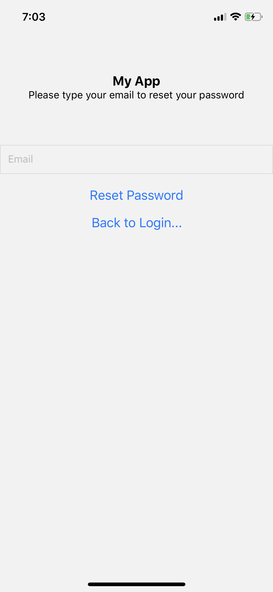
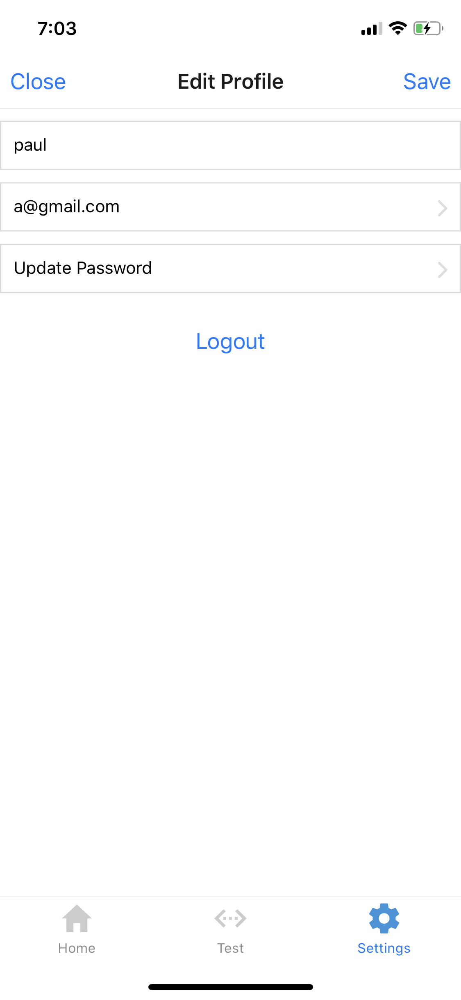
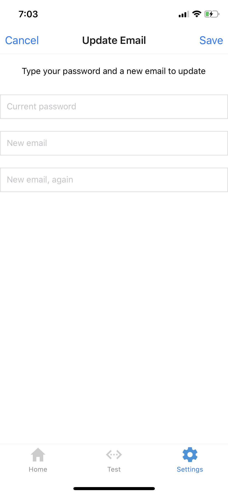
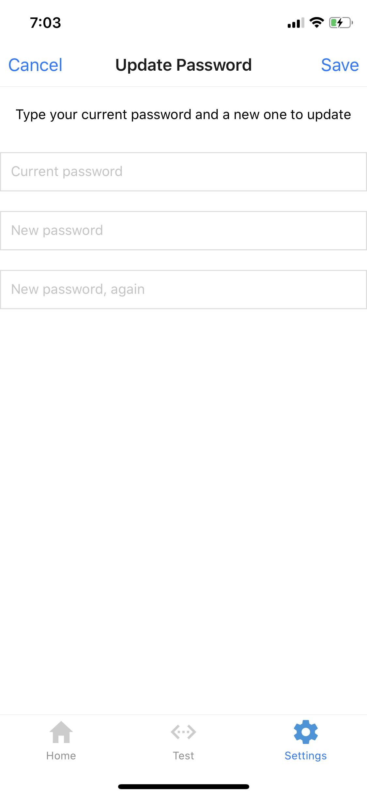

# Expo-Firebase-Auth-Template	
User Authentication template using:	
* React Native	
* Expo (version 37)	
* React Navigation (version 5)	

## Features	
* Login/Signup/Forgot Password screens	
* Update Email / Update Password screens	
* 3-tab navigation	

## Setup	

### Firebase Setup	Setup Instructions:
1. Create a new project in the Firebase console	
2. Enable email authentication	
3. Get the Firebase config object	

### Template Setup	    Firebase Setup:
1. Go to `/constants/ApiKeys.demo.js` and add your Firebase config data
   * Rename it to `/constants/ApiKeys.js`
   * Make sure to keep your API keys private (don't commit them to a public repo)
2. `npm install`
3. `expo start`

## Open Issues / Todo Items	
* `EditProfileScreen.js` needs to unsubscribe from watching user data when logging out	
* Implement a "Try as Guest" feature

## Screenshots

